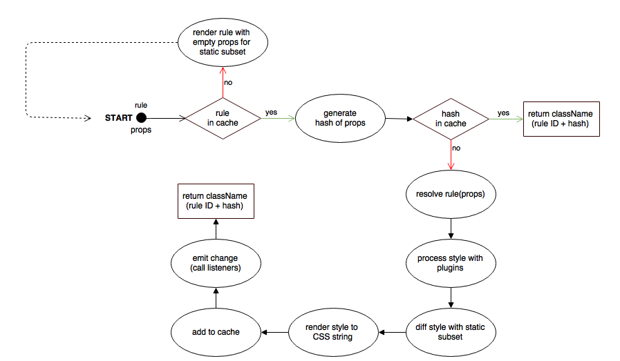

# Under The Hood

This section is all about how Fela works under the hood. Focusing on how rules are rendered and cached.

### Rendering Mechanism
Below is an abstract flow chart of what happens after the `Renderer.renderRule` method is called. *(see Image 1)*
> **Note**: A similar process is used to render keyframes, fonts and static styles, but with some steps skipped.

*(Image 1: Rendering Mechanism - `Renderer.renderRule`)*

Basically the first task is to check if the rule has already been used before (and therefore has the static subset already calculated). If not, it automatically calls `renderRule` with an empty props object. This way, every dynamic property gets stripped off and only the static subset remains. This is required to do the style diffing later. 
After rendering the static subset, it takes the passed props and generates a hash string. The hash is used as a reference in the cache. If it already exists, we can simply return the className, which is built off an unique ID for each rule and the generated hash. *(Static subsets do not have the hash postfix)* e.g. `c0 c0-foo` where `c0` is the static subset and `c0-foo` the dynamic part.
 
If this specific pair of rule and props has not been rendered before, the actual rendering takes part. It consists of the following four steps:

1. **Resolving**: Simply calls the rule which is a function by passing the props as parameter. It returns a style object with all dynamic values injected.

2. **Processing**: The style object gets piped through each plugin to perform style processing such as adding vendor prefixes or applying units.

3. **Diffing**: The fully processed style object now gets diffed against the prior rendered static subset to only extract dynamic properties

4. **Transformation**: Finally the extracted dynamic styles gets transformed into a single valid CSS string

Afterwards the styles get added to the cache and the previously generated className gets returned. 
In a final step the changes get emitted notifying each listener. For example, the DOM renderer `Fela.render` subscribes to changes to be able to immediately update the stylesheet.

### Caching mechanism
Coming soon.

### String Rendering
Coming soon.
