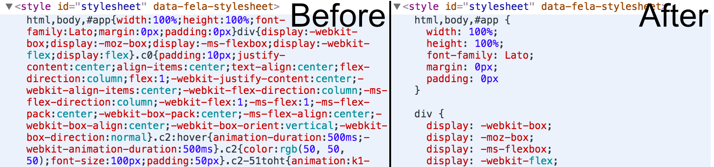

# fela-beautifier

 

The beautifier enhancer is a developer tool that automatically formats the rendered CSS markup on every change. It uses [cssbeautify](https://github.com/senchalabs/cssbeautify) to achieve this.

## Installation
```sh
yarn add fela-beautifier
```
You may alternatively use `npm i --save fela-beautifier`.

## Usage
```javascript
import { createRenderer } from 'fela'
import beautifier from 'fela-beautifier'

const renderer = createRenderer({
  enhancers: [ beautifier() ]
})
```

### Configuration
##### Options

Uses the same options as [cssbeautify](https://github.com/senchalabs/cssbeautify) does.

| Option | Value | Default | Description |
| ------ | --- | ------------ | --- |
|ident| *(string)* |`  ` (2 spaces)| a string used for the indentation of the declaration |
|openbrace| `end-of-line`, `separate-line` |`end-of-line`| placement of open curly brace |
| autosemicolon | *(boolean)* | `false` | insert semicolon after the last rule |

##### Example
```javascript
import { createRenderer } from 'fela'
import beautifier from 'fela-beautifier'

const beautifyEnhancer = beautifier({
  openbrace: 'separate-line',
  autosemicolon: 'false',
  ident: '  ',
})

const renderer = createRenderer({
  enhancers: [ beautifyEnhancer ]
})
```

## Example


## License
Fela is licensed under the [MIT License](http://opensource.org/licenses/MIT).<br>
Documentation is licensed under [Creative Common License](http://creativecommons.org/licenses/by/4.0/).<br>
Created with ♥ by [@rofrischmann](http://rofrischmann.de) and all the great contributors.
