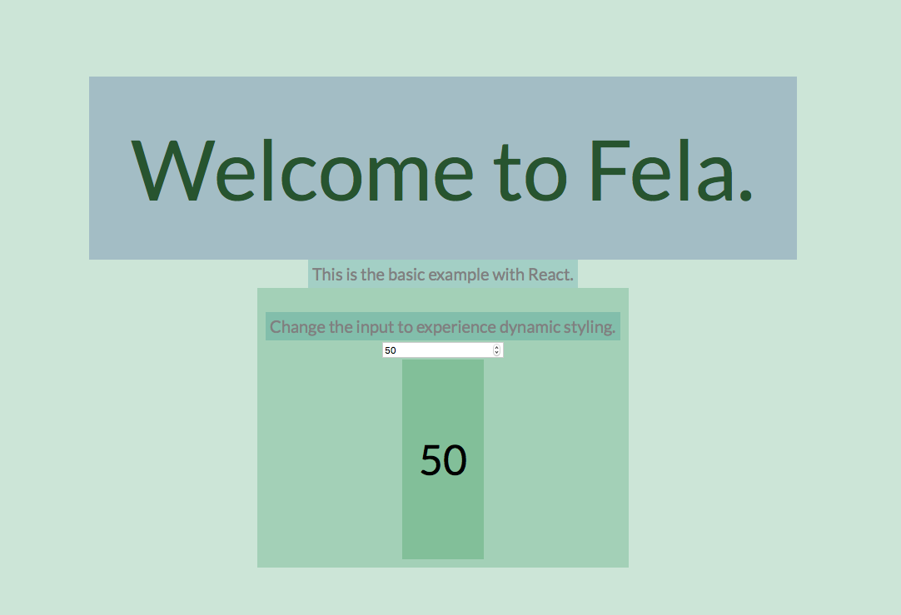
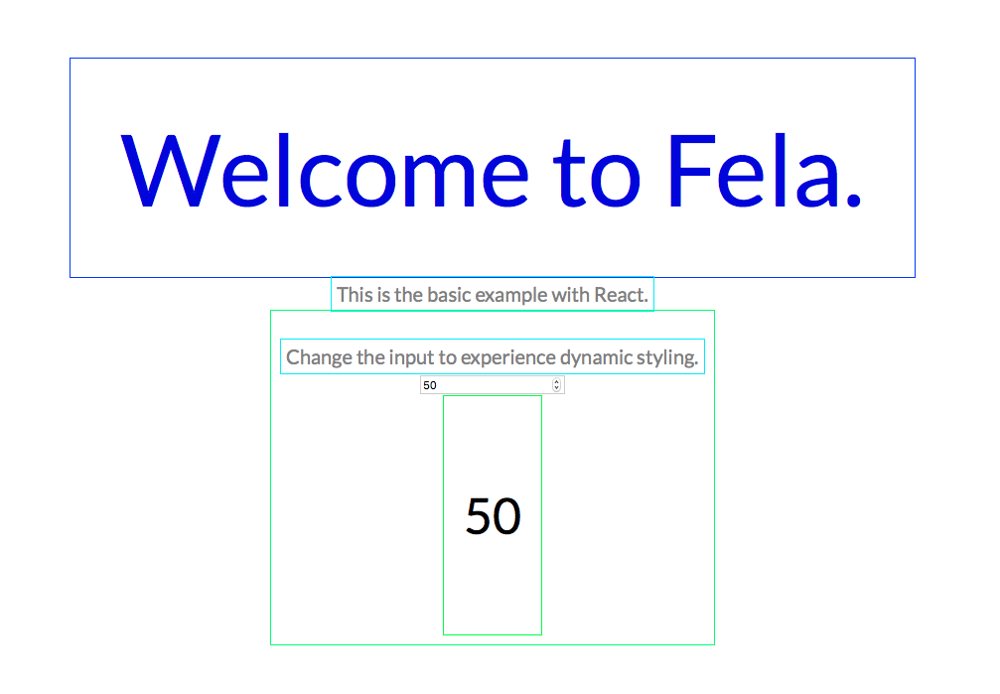

# fela-layout-debugger


 

Adds either colored outlines or a almost transparent background color to debug the application layout.<br>
Same rules will always have the same color.

## Installation
```sh
yarn add fela-layout-debugger
```
You may alternatively use `npm i --save fela-layout-debugger`.

## Usage
```javascript
import { createRenderer } from 'fela'
import layoutDebugger from 'fela-layout-debugger'

const renderer = createRenderer({
  enhancers: [ layoutDebugger() ]
})
```


### Configuration
##### Options
| Option | Value | Default | Description |
| --- | --- | --- | --- |
| `mode` | `outline`, `backgroundColor` | `outline` | sets the debug mode |
| `thickness` | *(number)* | `1` | outline thickness for `outline` mode |

##### Example
```javascript
import { createRenderer } from 'fela'
import layoutDebugger from 'fela-layout-debugger'

const layoutDebuggerEnhancer = layoutDebugger({
  mode: 'outline',
  thickness: 4
})

const renderer = createRenderer({
  enhancers: [ layoutDebuggerEnhancer ]
})
```

## Example
#### background-mode


#### outline-mode



## License
Fela is licensed under the [MIT License](http://opensource.org/licenses/MIT).<br>
Documentation is licensed under [Creative Common License](http://creativecommons.org/licenses/by/4.0/).<br>
Created with ♥ by [@rofrischmann](http://rofrischmann.de) and all the great contributors.
