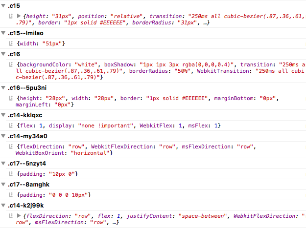

# fela-logger


Logging tool for Fela. Logs changes to the console, grouped by selector, animation name or font family.

## Installation
```sh
npm i --save fela-logger
```
Assuming you are using [npm](https://www.npmjs.com) as your package manager you can just `npm install`.<br>
Otherwise we also provide a [UMD](https://github.com/umdjs/umd). You can easily use it via [unpkg](https://unpkg.com/). It registers a `FelaLogger` global.
```HTML
<!-- Fela (Development): Unminified version including all warnings -->
<script src="https://unpkg.com/fela-logger@4.3.4/dist/fela-logger.js"></script>
<!-- Fela (Production): Minified version -->
<script src="https://unpkg.com/fela-logger@4.3.4/dist/fela-logger.min.js"></script>
```


## Usage
```javascript
import { createRenderer } from 'fela'
import logger from 'fela-logger'

const renderer = createRenderer({
  enhancers: [ logger() ]
})
```
### Configuration
##### Options
| Option | Value | Default | Description |
| --- | --- | --- | --- |
| `logCSS` | *(boolean)* | `false` | logs rendered CSS string |
| `formatCSS` | *(boolean)* | `false` |  logs formatted CSS strings<br>only together with `logCSS: true` |

##### Example
```javascript
import { createRenderer } from 'fela'
import logger from 'fela-logger'

const loggerEnhancer = logger({
  logCSS: true,
  formatCSS: true
})

const renderer = createRenderer({
  enhancers: [ loggerEnhancer ]
})
```

## Example


## License
Fela is licensed under the [MIT License](http://opensource.org/licenses/MIT).<br>
Documentation is licensed under [Creative Common License](http://creativecommons.org/licenses/by/4.0/).<br>
Created with ♥ by [@rofrischmann](http://rofrischmann.de) and all the great contributors.
