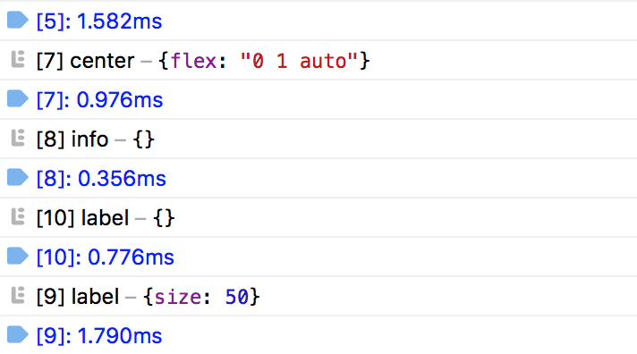

# fela-perf

  <a href="https://bundlephobia.com/result?p=fela-perf@latest"></a>

Performance devTool to be used with Fela. It logs elapsed time during render cycles.

## Installation
```sh
yarn add fela-perf
```
You may alternatively use `npm i --save fela-perf`.

## Usage
```javascript
import { createRenderer } from 'fela'
import perf from 'fela-perf'

const renderer = createRenderer({
  enhancers: [ perf() ]
})
```

## Example


## License
Fela is licensed under the [MIT License](http://opensource.org/licenses/MIT).<br>
Documentation is licensed under [Creative Common License](http://creativecommons.org/licenses/by/4.0/).<br>
Created with ♥ by [@robinweser](http://weser.io) and all the great contributors.
