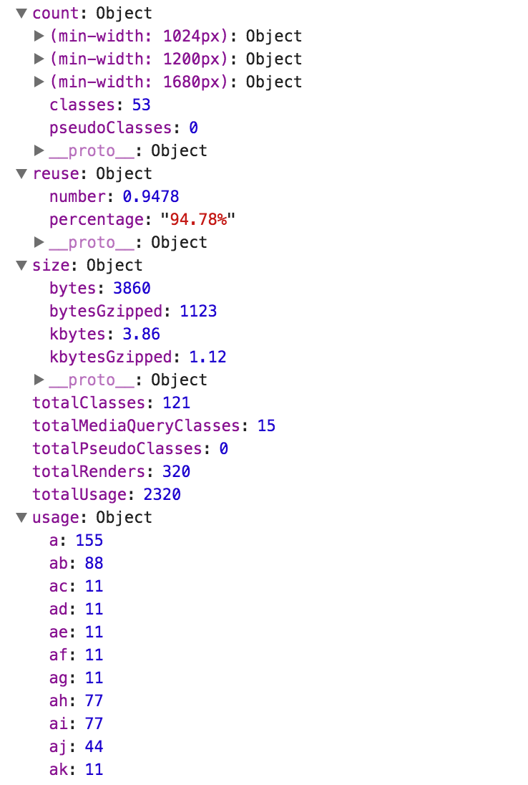

# fela-statistics

 

Statistic generation tool for Fela. It collects several information and metrics to better analyze your application CSS.<br>
Right now, it provides the following information:

* Class count
  * per media query
  * with/without pseudo class
* Usage per class
* CSS file size
  * in bytes, kbytes, bytes (gzipped) and kbytes (gzipped)
* Reuse
  * Reuse ratio (total used classes vs. total unique classes)
* total classes with pseudo classes
* total classes inside media queries
* total renders
* total used classes

## Installation
```sh
yarn add fela-statistics
```
You may alternatively use `npm i --save fela-statistics`.


## Usage
Adding the statistics enhancer will add a new function to the renderer called `getStatistics`.<br>
You may call it at any given time, to get the current statistics object.

```javascript
import { createRenderer } from 'fela'
import statistics from 'fela-statistics'

const renderer = createRenderer({
  enhancers: [ statistics() ]
})

// rendering stuff

const stats = renderer.getStatistics()
console.log(stats)
```

## Example


## License
Fela is licensed under the [MIT License](http://opensource.org/licenses/MIT).<br>
Documentation is licensed under [Creative Common License](http://creativecommons.org/licenses/by/4.0/).<br>
Created with ♥ by [@rofrischmann](http://rofrischmann.de) and all the great contributors.
